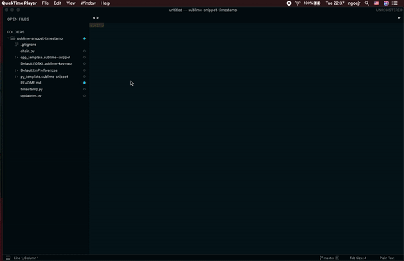

# sublime-snippet-timestamp
Plugin to add timestamp to sublime snippet.

### TADA


### Instruction
* Copy all file to ```Packages/User``` directory of sublime text.
* Configure sublime-snippet file as you want ( ```cpp_template.sublime-snippet``` for c++ and ```py_template.sublime-snippet``` for python)
* Now you can create a simple snippet and the date will be updated every time you press ```command + s```. ```command + s``` still has the function to save files.


### Explaination
* Because snippet doesnot support dynamic variable, I use static variable ```DATE``` define in ```Default.tmPreferences``` and update this variable when we want to create snippet. 

* I use a plugin (command) ```updatetm``` to update ```DATE``` in ```Default.tmPreferences```.

* I want the date and time to be updated automatically or at least passive. So I added a function that called ```updatetm``` command for keystrockes ```command + s```. To do this, I use another plugin is ```chain.py``` to call multiple command on a keymap (both ```updatetm``` command and the default command (```save```). Keymap defined in ```Default (OSX).sublime-snippet``` file.
